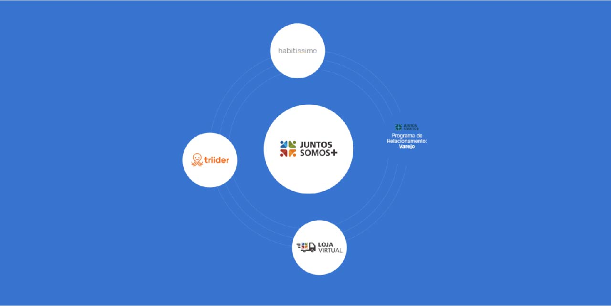

<p align="center">
   
  <br />
</p>
<p align="center">
  <a href="https://github.com/micheldslive/jsm-challenge#about-">About</a> •  
  <a href="https://github.com/micheldslive/jsm-challenge#techs-">Techs</a> •  
  <a href="https://github.com/micheldslive/jsm-challenge#getting-started-">Getting started</a> •  
  <a href="https://jsm.mi-code.dev/" target="_blank">Live demo</a> •
</p>

## About 💻

Project made for Juntos Somos Mais front end challenge.

## Libs, Apps, Configs and Packages 🚀

The project was developed with following main libraries:


- `app`
  - `@jsm/backend`: a [Node.js](https://nodejs.org/en) app, architecture for use in nextjs web application endpoints
  - `@jsm/web`: a [Next.js](https://nextjs.org/) app
- `packages`
  - `@jsm/storybook`: another [Storybook](https://storybook.js.org/) app
  - `@jsm/ui`: a stub React component library shared by both `web` and `storybook` applications
- `configs`
  - `@jsm/eslint-config`: `eslint` configurations (includes `eslint-config-next` and `eslint-config-prettier`)
  - `@jsm/assets`: `assets` used throughout the monorepo
  - `@jsm/ts-config`: `tsconfig.json` used throughout the monorepo
  - `@jsm/tailwind-config`: `tailwind.config.json` and `postcss.config.json` used throughout the monorepo

Each package/app is 100% [TypeScript](https://www.typescriptlang.org/).

The project was developed with following main libraries:

- Styling with **[TailwindCSS](https://tailwindcss.com)**
- **[Radix UI](https://www.radix-ui.com)** accessible and customizable library
- **[Storybook](https://storybook.js.org/)** to create a domented app library
- **[React Hook Form](https://react-hook-form.com)** to deal with forms
- Modern State Manager with **[Zustand](https://github.com/pmndrs/zustand)**
- Linting with **[Eslint](https://eslint.org)**
- Conventional commits with **[config-conventional](https://www.npmjs.com/package/@commitlint/config-conventional?activeTab=versions)**
- Code formatting with **[Prettier](https://prettier.io)**
- Git hook with **[Husky](https://github.com/typicode/husky)**
- **[Lint Staged](https://github.com/okonet/lint-staged)** to check staged files before commits
- Static Types with **[Typescript](https://www.typescriptlang.org)**
- Runtime schema validation with **[Zod](https://zod.dev)**
- Generate new components with **[turbo/gen](https://turbo.build/repo/docs/reference/command-line-reference/gen)**

## Getting Started 📦

Clone this repository in your local machine:

```bash
git clone https://github.com/micheldslive/jsm-challenge.git
```

Then move to the project directory

```bash
cd jsm-challenge
```

Install the project dependencies, in the root `./` of the turborepo, make sure you have node 20.11 version:

```bash
pnpm i
```

Create a `.env` file in `/apps/web` and copy the contents of .env.example and run the main web application locally and open up [local host](http://localhost:3000)

```bash
pnpm dev
# or
yarn dev
```

The main components of the application were documented. To access them in their locale, open the following up [local host](http://localhost:6006)


## Developer 💻<br>

<table>
  <tr>
    <td align="center">
      <a href="https://github.com/micheldslive">
        <br>
        <sub>
          <b>Michel Domingos</b>
        </sub>
      </a>
    </td>
  </tr>
</table>

## 🖊️ License

This project is licensed under the MIT License - see the LICENSE page for details.
